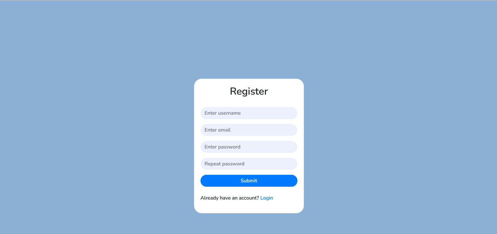
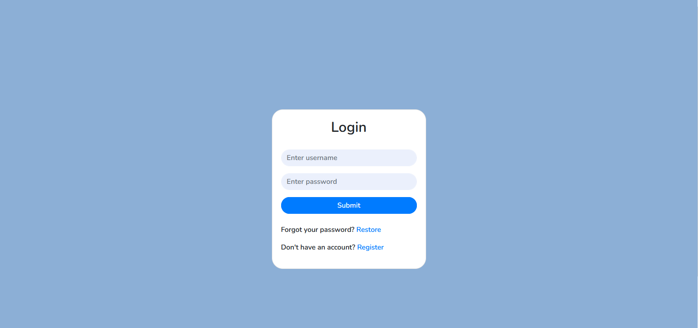
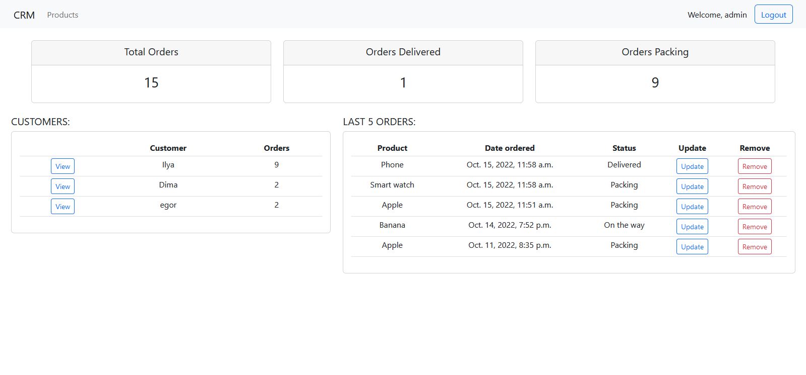
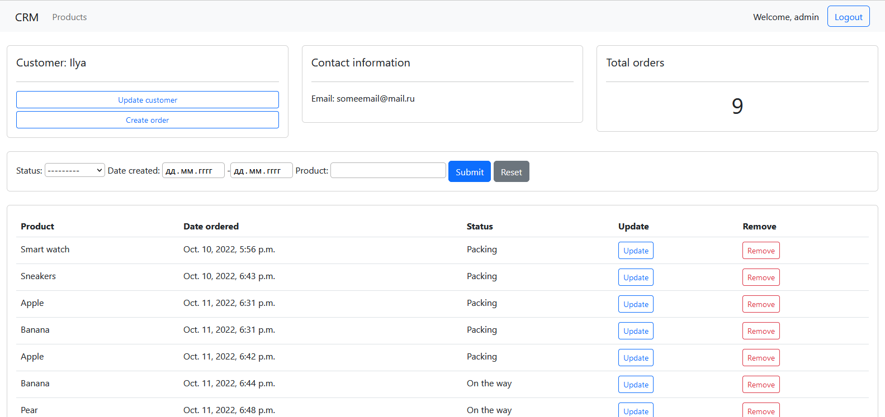
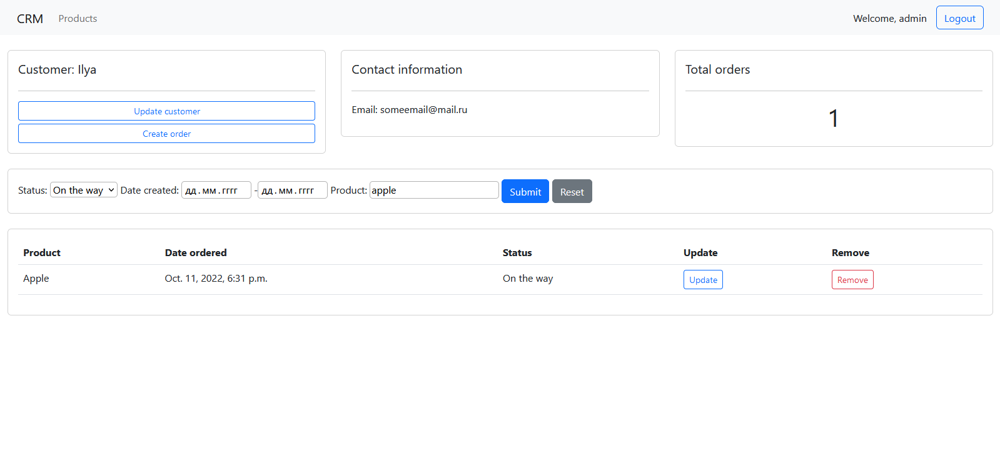
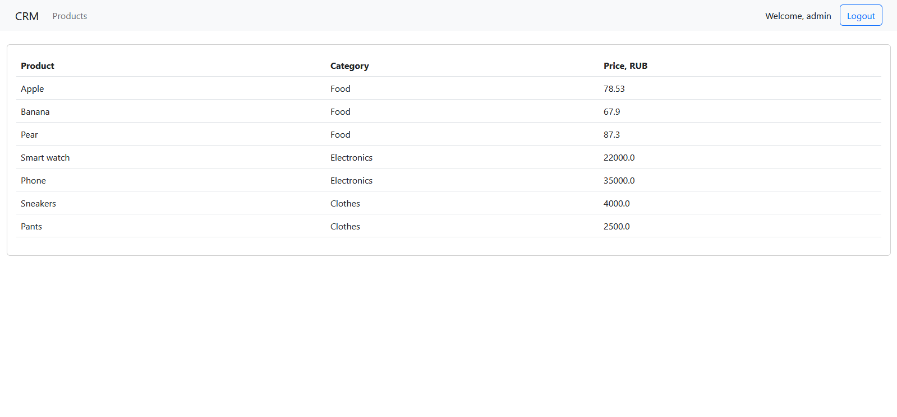
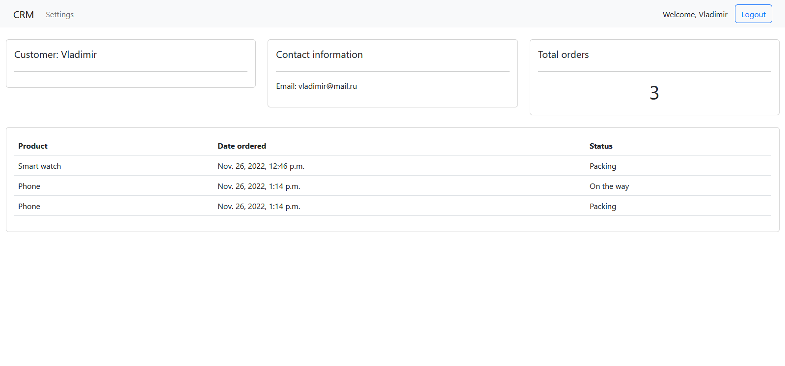
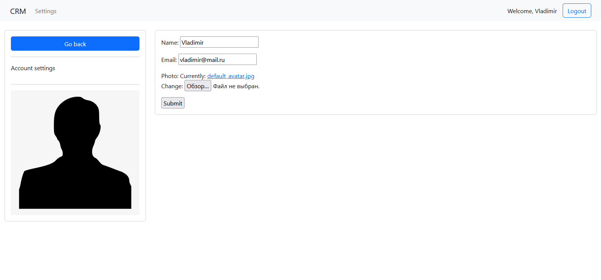

# CRM

CRM with the following functionality:
- registration, authorization and password recovery
- viewing current orders 
- editing data in profile page
- managing user's data, managing orders (admin only)

# Project overview
## Registration and authorization

Registration form.

Login form.

## Admin functionality.

Viewing orders, updating and removing them.

Viewing user's data and orders, updating it.

Filtering user's orders.

Viewing table of all products and their data.

## User functionality

Viewing own data and orders.

Viewing and updating own profile.

---

# Reflection

Creating this project I got familiar with building backend on Django and frontend with HTML/CSS and Bootstrap.
